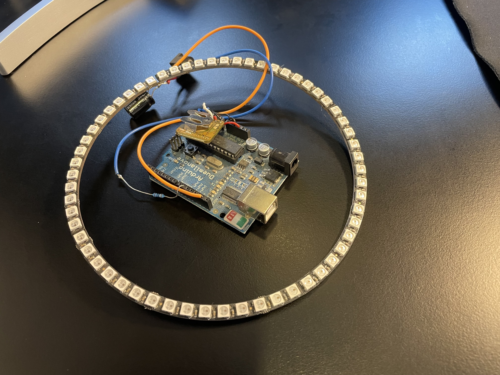

Those who've known me for a while know I essentially have an electrical engineering degree, and one of my hobbies about ten years ago was playing with Arduinos and microcontrollers. I've always wanted to build a clock with a NeoPixel ring, sitting on the wall, gently glowing with a couple of different changeable presets, but I never managed to get it over the line. The hardware has been in a box for at least one child's life and one house move.

Last night I gave the project to an AI assistant. It basically one-shotted the whole thing, and on reflection that showed me exactly where I'd been getting stuck.

I understood the polling loop well enough: update inputs, do calculations, render. Where I kept hitting a wall was wanting different presets for how the clock should look, and trying to render elements with sub-second accuracy with a RTC module that only has second resolution. The missing link turned out to be state in C++ classes — keeping track of where each preset was between one tick and the next. Obvious in hindsight, but I never got there solo.

In about 10 minutes I had a project scaffolded. It took me longer to find all the parts and clean the dust off them. Uploaded to the Arduino board still wired to the light ring and it ... just worked?

I have a bunch of different Arduinos that might have a new lease of life now. Embedded programming is somewhere I got very rusty, and with two young children I'm extremely time-poor — a barrier that did kill this project, for at least five years. Right now, models like these are more than capable of getting me started, unblocked, and iterating. That's a completely different shape to how I would have done this twelve months ago.

Solid platform to play and extend from. The RTC battery is dead so it loses time on power loss — needs a CR2016. And I still need to work out how to build the enclosure and package it for the wall. Last time around I would have said laser-cut frosted plastic, but now I guess it'll be a trip to the central library to use a 3D printer?

For the first time in years this project feels alive rather than stalled in my head.
